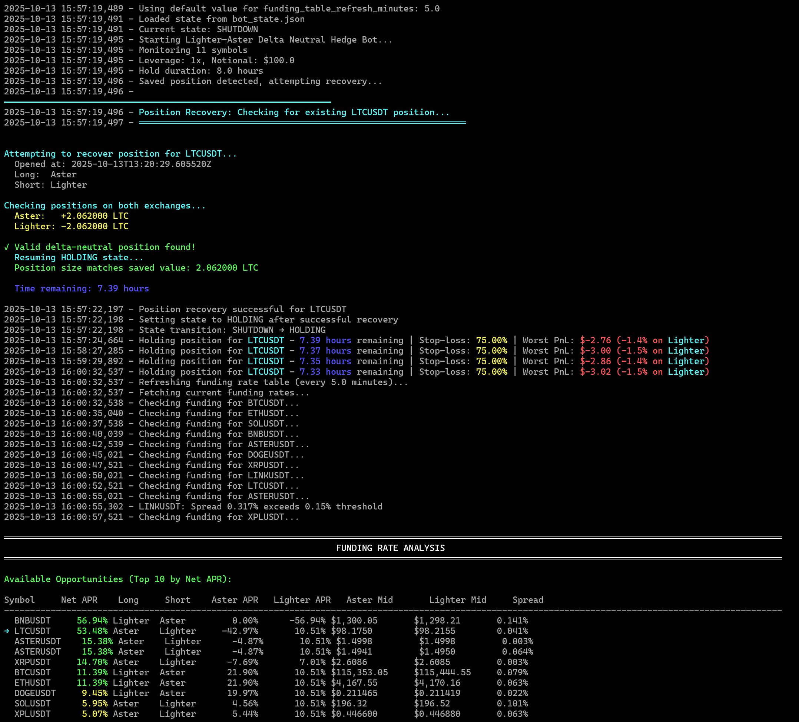

# Lighter-Aster Cross-Exchange Delta Neutral Strategy

Delta-neutral strategy across LIGHTER and ASTER cryptocurrency perpetual futures exchanges. Captures funding rate while maintaining market-neutral exposure and generating volume with forced position refresh at regular intervals.

## Overview

This bot implements a cross-exchange delta-neutral trading strategy that:

1. **Analyzes funding rates** across multiple symbols on both Lighter and Aster
2. **Opens delta-neutral positions** (long on one exchange, short on the other)
3. **Holds positions** for 8 hours to collect funding payments (configurable)
4. **Closes positions** and realizes PnL
5. **Repeats the cycle** automatically

---

**💡 Referral link to support this work:** https://www.asterdex.com/en/referral/164f81
**Earn 10% rebate on fees** (I put maximum for you).

---

### Key Features

- ✅ **Delta-neutral** - Market-neutral exposure by going long and short simultaneously
- ✅ **Funding rate arbitrage** - Profits from funding rate differences between exchanges
- ✅ **Persistent state** - Recovers from crashes and restarts with automatic position reconciliation
- ✅ **PnL tracking** - Real-time unrealized PnL monitoring with percentage display per exchange (always active)
- ✅ **Stop-loss execution** - Automatic position closure when worst-leg PnL exceeds threshold (75% of liquidation threshold)
- ✅ **Rate limiting** - Built-in retry logic with exponential backoff
- ✅ **Color-coded output** - Easy-to-read terminal output with status colors
- ✅ **Emergency exit** - Standalone script for immediate position closure
- ⚠️ **Health monitoring flag** - Not implemented (planned feature, flag has no effect)
- ⚠️ **Advanced statistics** - Cycle counters work, but detailed PnL/volume stats not populated

## Strategy Logic

The bot follows this flow (adapted from `lighter_edgex_hedge.py`):

1. **Funding Rate Analysis**
   - Fetches funding rates from both Lighter (3x/day) and Aster (6x/day)
   - Calculates annualized APR for each exchange
   - Determines optimal hedge direction (long vs short on each exchange)
   - Filters by minimum APR threshold and spread constraints

2. **Position Opening**
   - Calculates position size based on available capital and leverage
   - Aligns size to both exchanges' tick sizes (precision)
   - Configures leverage on both exchanges
   - Places orders concurrently:
     - **Lighter**: Aggressive limit orders (crossing the spread)
     - **Aster**: Market orders
   - Verifies positions opened successfully

3. **Position Holding**
   - Monitors position health every 60 seconds (configurable)
   - Tracks unrealized PnL on both exchanges in real-time
   - Displays worst-leg PnL (most negative) with percentage and exchange name
   - Shows stop-loss threshold based on leverage
   - **Executes stop-loss** - Closes position early if worst-leg PnL exceeds threshold
   - Refreshes funding rate table every 5 minutes (configurable)
   - Waits for configured hold duration (default: 8 hours) unless stop-loss triggered

4. **Position Closing**
   - Closes both positions concurrently when hold duration expires
   - **Lighter**: Reduce-only aggressive limit orders
   - **Aster**: Reduce-only market orders
   - Verifies positions closed successfully
   - Calculates realized PnL

5. **Cycle Completion**
   - Updates statistics and state
   - Waits for configured delay (default: 5 minutes)
   - Returns to analysis phase

## Project Structure

```
lighter_aster_hedge.py       # Main strategy file
emergency_exit.py            # Emergency position closer (standalone)
lighter_client.py            # Lighter exchange connector (included)
aster_api_manager.py         # Aster exchange connector (included)
utils.py                     # Utility functions (included - required by aster_api_manager.py)
strategy_logic.py            # Strategy logic stub (included - required by aster_api_manager.py)
config.json                  # Bot configuration
.env                         # Environment variables (credentials)
.env.example                 # Environment template
requirements.txt             # Python dependencies
bot_state.json               # Persistent state (auto-generated)
logs/                        # Log files (auto-generated)
README.md                    # This file
EMERGENCY_EXIT_README.md     # Emergency exit documentation
```

## Prerequisites

- Python 3.8+
- Active accounts on both Lighter and Aster exchanges
- API credentials for both exchanges
- Sufficient capital (recommended: $500+ for meaningful positions)

## Installation

### Step 1: Copy Required Connector Files

**IMPORTANT**: The strategy uses two exchange connectors that must be copied from source projects:

1. **Copy `lighter_client.py`** from `CROSS_EXCHANGE_DELTA_NEUTRAL_LIGHTER_EDGEX-main/`
   ```bash
   cp ../CROSS_EXCHANGE_DELTA_NEUTRAL_LIGHTER_EDGEX-main/lighter_client.py .
   ```

2. **Copy `aster_api_manager.py`** from `DELTA_NEUTRAL_VOLUME_BOT_ASTER_PERP_SPOT-main/`
   ```bash
   cp ../DELTA_NEUTRAL_VOLUME_BOT_ASTER_PERP_SPOT-main/aster_api_manager.py .
   ```

**Note**: `utils.py` and `strategy_logic.py` are already included in this project as required dependencies for `aster_api_manager.py`.

### Step 2: Install Python Dependencies

```bash
pip install -r requirements.txt
```

Or install manually:
```bash
pip install python-dotenv aiohttp web3 eth-account eth-abi lighter-python
```

### Step 3: Configure Environment

```bash
cp .env.example .env
# Edit .env with your credentials (see below)
```

### Step 4: Configure Credentials

**Configure credentials in `.env`**:

   **For Lighter** (Required):
   - `API_KEY_PRIVATE_KEY` - Your Lighter private key
   - `ACCOUNT_INDEX` - Lighter account index (usually 0)
   - `API_KEY_INDEX` - Lighter API key index (usually 0)

   **For Lighter** (Optional):
   - `LIGHTER_BASE_URL` - Lighter API endpoint (default: `https://mainnet.zklighter.elliot.ai`)
   - `LIGHTER_WS_URL` - Lighter WebSocket endpoint (default: `wss://mainnet.zklighter.elliot.ai/stream`)

   **For Aster** (Required):
   - `ASTER_API_USER` - Your Ethereum wallet address
   - `ASTER_API_SIGNER` - Authorized signer address
   - `ASTER_API_PRIVATE_KEY` - Private key for signing
   - `ASTER_APIV1_PUBLIC` - API public key
   - `ASTER_APIV1_PRIVATE` - API private key

### Step 5: Review Configuration (Optional)

**Review and customize `config.json`**:
   - `symbols_to_monitor` - List of symbols to analyze
   - `leverage` - Leverage multiplier (1-5x recommended)
   - `notional_per_position` - Position size in USD
   - `hold_duration_hours` - How long to hold positions
   - `min_net_apr_threshold` - Minimum APR to open positions
   - Other parameters (see Configuration section below)

## Configuration

Edit `config.json` to customize bot behavior:

```json
{
  "symbols_to_monitor": ["BTC", "ETH", "SOL", ...],
  "quote": "USDT",
  "leverage": 3,
  "notional_per_position": 100.0,
  "hold_duration_hours": 8.0,
  "wait_between_cycles_minutes": 5.0,
  "check_interval_seconds": 60,
  "min_net_apr_threshold": 5.0,
  "max_spread_pct": 0.15,
  "enable_stop_loss": true,              // ✅ FUNCTIONAL - Closes position early if threshold breached
  "enable_pnl_tracking": true,           // ⚠️ NON-FUNCTIONAL - PnL always tracked regardless
  "enable_health_monitoring": true,      // ⚠️ NOT IMPLEMENTED - Planned feature
  "funding_table_refresh_minutes": 5.0
}
```

### Parameter Reference

| Parameter | Type | Default | Description |
|-----------|------|---------|-------------|
| `symbols_to_monitor` | list | `["BTC", "ETH", ...]` | Symbols to analyze (without USDT suffix) |
| `quote` | string | `"USDT"` | Quote currency |
| `leverage` | int | `3` | Leverage multiplier (1-5x recommended) |
| `notional_per_position` | float | `100.0` | Position size in USD |
| `hold_duration_hours` | float | `8.0` | Hold duration (8h = 1 Lighter funding cycle) |
| `wait_between_cycles_minutes` | float | `5.0` | Wait time between cycles |
| `check_interval_seconds` | int | `60` | Position health check interval |
| `min_net_apr_threshold` | float | `5.0` | Minimum net APR to open position (%) |
| `max_spread_pct` | float | `0.15` | Maximum cross-exchange spread (%) |
| `enable_stop_loss` | bool | `true` | Enable automatic stop-loss execution (closes position early if threshold breached) |
| `enable_pnl_tracking` | bool | `true` | ⚠️ **Non-functional** - PnL tracking is always active regardless of this setting |
| `enable_health_monitoring` | bool | `true` | ⚠️ **Not implemented** - Planned feature, currently has no effect |
| `funding_table_refresh_minutes` | float | `5.0` | Funding rate table refresh interval during hold |

## Usage

### Run the bot

```bash
python lighter_aster_hedge.py
```

### Run with custom config

```bash
python lighter_aster_hedge.py --config my_config.json
```

### Run with custom state file

```bash
python lighter_aster_hedge.py --state-file my_state.json
```

### Stop the bot

Press `Ctrl+C` for graceful shutdown. The bot will:
- Save current state
- NOT close open positions (manual closure required)
- Exit cleanly

### Emergency Exit

For immediate position closure in emergency situations, use the standalone emergency exit script:

```bash
python emergency_exit.py
```

**Features:**
- ✅ Automatically detects all delta-neutral positions on both exchanges
- ✅ Shows detailed position info with unrealized PnL for each leg
- ✅ Calculates and displays total PnL with color coding
- ✅ Requires manual confirmation before closing
- ✅ Closes positions on both exchanges simultaneously
- ✅ Verifies closure after execution
- ✅ Works independently from the main bot

**Use cases:**
- Market volatility requiring immediate exit
- Bot malfunction or stuck state
- Manual intervention needed outside normal cycle
- Risk management - reduce exposure immediately

**See [EMERGENCY_EXIT_README.md](EMERGENCY_EXIT_README.md) for detailed documentation.**

## State Management

The bot maintains persistent state in `bot_state.json`:

- **Current state**: IDLE, ANALYZING, OPENING, HOLDING, CLOSING, WAITING, ERROR
- **Current position**: Active position details (symbol, exchanges, leverage, timestamps, metadata)
- **Capital status**: Balance and available capital on both exchanges ⚠️ *Not currently populated*
- **Completed cycles**: Historical cycle data (symbol, timestamps, status, expected APR, stop-loss details)
- **Cumulative stats**:
  - ✅ **Working**: `total_cycles`, `successful_cycles`, `failed_cycles`, `last_error`, `last_error_at`
  - ⚠️ **Not populated**: `total_realized_pnl`, `total_trading_pnl`, `total_funding_pnl`, `total_fees_paid`, `best_cycle_pnl`, `worst_cycle_pnl`, `total_volume_traded`, `total_hold_time_hours`, `by_symbol` (planned features)

### Recovery After Crash

If the bot crashes or is stopped, it will:
1. Load state from `bot_state.json` on restart
2. Verify positions exist on both exchanges
3. Check that positions are properly delta-neutral (opposite sides)
4. Reconcile position sizes if mismatch detected between saved state and actual
5. Resume monitoring and close positions when hold duration expires

**Position Reconciliation:**
- On startup, the bot checks actual position sizes on both exchanges
- If the real position size differs from saved `size_base` by >0.1% or >0.001 units:
  - Updates `size_base` to the average of actual sizes
  - Logs the discrepancy and correction
- This ensures accurate PnL calculations after recovery

**Note**: The bot does NOT automatically detect positions opened outside the bot. Only positions tracked in `bot_state.json` are monitored.

## Monitoring

### Console Output

The bot displays color-coded real-time information:

- **Funding rate analysis table** - APR for each symbol with spread filtering
- **Position opening progress** - Order placement status (green=success, red=error)
- **Position holding updates** - Time remaining, stop-loss %, worst PnL with exchange
- **Position closing progress** - Closure verification with color indicators

**Color Coding:**
- 🟢 **Green** - Success messages, verified positions, closed positions
- 🔴 **Red** - Errors, failed operations, remaining positions after close
- 🟡 **Yellow** - Warnings, partial fills, current open positions
- 🔵 **Cyan** - Status messages, informational headers
- ⚪ **Gray** - Flat positions, inactive states

**Enhanced Holding Display:**
```
Holding position for BTCUSDT - 7.60 hours remaining | Stop-loss: 25.00% | Worst PnL: $-1.76 (-0.9% on Aster)
```
- Shows calculated stop-loss threshold (75% of liquidation level)
- Displays worst-leg unrealized PnL in dollars
- Shows PnL as percentage of position value
- Identifies which exchange has the worst PnL

### Log Files

Detailed logs are saved to `logs/lighter_aster_hedge.log`:

- **INFO level**: Console messages
- **DEBUG level**: Detailed API calls, calculations, state changes

## Risk Management

### Stop-Loss

When enabled (`enable_stop_loss: true`), the bot automatically calculates and **executes** stop-loss based on leverage:

**Formula**: Stop-loss = 75% of liquidation threshold = `(100 / leverage) * 0.75`

- **3x leverage**: 25.00% stop-loss per leg
- **2x leverage**: 37.50% stop-loss per leg
- **1x leverage**: 75.00% stop-loss per leg

**How it works:**
- Stop-loss is set at 75% of the liquidation threshold for safety margin
- Monitors the **worst-performing leg** (most negative unrealized PnL)
- Tracks PnL as percentage of position value in real-time
- **Automatically closes the position early** when worst leg exceeds the calculated threshold
- Marks cycle as "stop-loss" in completed cycles with PnL details
- Logs warning message showing which exchange triggered the stop-loss

**Example:**
```
⚠️  STOP-LOSS TRIGGERED! Worst PnL: -26.3% >= 25.00% threshold on Lighter
Closing position early due to stop-loss...
```

This protects against liquidation while accounting for normal market volatility.

### Position Limits

- **Minimum position**: $10 USD equivalent
- **Maximum position**: Limited by available capital * leverage
- **Capital check**: Bot verifies sufficient capital before opening

### Spread Filtering

Positions are only opened when cross-exchange spread is below `max_spread_pct` (default: 0.15%). This prevents opening positions when markets are misaligned.

## Connectors (DO NOT EDIT)

The bot uses two connector modules that should **NOT be edited**:

### `lighter_client.py`

Provides functions for Lighter exchange:
- `get_lighter_balance()` - Fetch balance via WebSocket
- `get_lighter_market_details()` - Get market ID, ticks
- `get_lighter_best_bid_ask()` - Get order book prices
- `lighter_set_leverage()` - Configure leverage
- `get_lighter_open_size()` - Get position size
- `get_lighter_funding_rate()` - Get funding rate
- `lighter_place_aggressive_order()` - Place aggressive limit order
- `lighter_close_position()` - Close position with reduce-only

### `aster_api_manager.py`

Provides methods for Aster exchange:
- `get_perp_account_info()` - Fetch account info
- `get_perp_book_ticker()` - Get bid/ask prices
- `get_funding_rate_history()` - Get funding rates
- `place_perp_market_order()` - Place market order
- `close_perp_position()` - Close position
- `get_perp_leverage()` / `set_perp_leverage()` - Manage leverage
- `get_perp_symbol_filter()` - Get precision filters

## Funding Rate Mechanics

### Lighter
- **Frequency**: Every 8 hours (3x per day)
- **Times**: 00:00, 08:00, 16:00 UTC
- **APR calculation**: `rate * 3 * 365 * 100`

### Aster
- **Frequency**: Every 4 hours (6x per day)
- **Times**: 00:00, 04:00, 08:00, 12:00, 16:00, 20:00 UTC
- **APR calculation**: `rate * 6 * 365 * 100`

### Net APR

The bot calculates net APR as the difference between receiving and paying rates:

```
If Long Aster + Short Lighter:
  Net APR = Lighter APR - Aster APR

If Long Lighter + Short Aster:
  Net APR = Aster APR - Lighter APR
```

## Example Run

```
2025-10-13 10:00:00 - Starting Lighter-Aster Delta Neutral Hedge Bot...
2025-10-13 10:00:00 - Monitoring 9 symbols
2025-10-13 10:00:00 - Leverage: 3x, Notional: $100.0
2025-10-13 10:00:00 - Hold duration: 8.0 hours

════════════════════════════════════════════════════════════════════════════════════════════════════════════════════════════════════
                                                        FUNDING RATE ANALYSIS
════════════════════════════════════════════════════════════════════════════════════════════════════════════════════════════════════

Available Opportunities (Top 10 by Net APR):

Symbol       Net APR    Long      Short     Aster APR   Lighter APR   Aster Mid       Lighter Mid     Spread
──────────────────────────────────────────────────────────────────────────────────────────────────────────────────────────────────
→ LTCUSDT     45.60%   Aster     Lighter      58.32%       12.72%     $97.0200        $97.1290        0.112%
  BTCUSDT      9.20%   Lighter   Aster        15.30%       24.50%     $45,123.50      $45,087.20      0.080%
  ETHUSDT      5.80%   Lighter   Aster        12.40%       18.20%     $2,512.35       $2,510.80       0.062%

════════════════════════════════════════════════════════════════════════════════════════════════════════════════════════════════════

2025-10-13 10:00:05 - Opening position for LTCUSDT (Net APR: 45.60%)

Setting leverage to 3x on both exchanges...
  ✓ Lighter: Set to 3x (cross margin)
  ✓ Aster: Set to 3x
  ✓ Aster: Verified at 3x
  ℹ Lighter: Verification not available (applies on next order)
✓ Leverage configured on both exchanges

✓ Both orders placed successfully

Verifying positions...
  Aster position:   +2.062000 LTC
  Lighter position: -2.062000 LTC

✓ Hedge opened successfully!
  Total exposure: 2.062000 LTC on each exchange
  Delta-neutral: LONG Aster, SHORT Lighter

2025-10-13 10:00:10 - Position opened successfully, now holding...
2025-10-13 11:00:10 - Holding position for LTCUSDT - 7.00 hours remaining | Stop-loss: 25.00% | Worst PnL: $-1.23 (-0.6% on Lighter)
2025-10-13 12:00:10 - Holding position for LTCUSDT - 6.00 hours remaining | Stop-loss: 25.00% | Worst PnL: $+0.58 (+0.3% on Lighter)
2025-10-13 13:00:10 - Holding position for LTCUSDT - 5.00 hours remaining | Stop-loss: 25.00% | Worst PnL: $-0.34 (-0.2% on Aster)

[Refreshing funding rate table every 5 minutes...]

2025-10-13 18:00:10 - Hold duration complete, closing position...

┌──────────────────────────────────────────────────────────────────┐
│                   Closing Delta-Neutral Hedge                     │
├──────────────────────────────────────────────────────────────────┤
│  Symbol: LTCUSDT                                                 │
└──────────────────────────────────────────────────────────────────┘

Checking current positions...
  Aster position:  +2.062000 LTC
  Lighter position: -2.062000 LTC

Closing positions on both exchanges...
  Closing Lighter SHORT position: 2.062000 LTC
  Closing Aster LONG position: 2.062000 LTC
  ✓ Close orders sent for LTCUSDT

Verifying closure...
  Aster position:  +0.000000 LTC
  Lighter position: -0.000000 LTC

✓ Hedge closed successfully on both exchanges!

2025-10-13 18:00:15 - Cycle complete! Waiting 5 minutes before next cycle...
```

### Example: Stop-Loss Trigger

```
2025-10-13 10:00:10 - Position opened successfully, now holding...
2025-10-13 11:00:10 - Holding position for BTCUSDT - 7.00 hours remaining | Stop-loss: 25.00% | Worst PnL: $-12.34 (-6.2% on Lighter)
2025-10-13 12:00:10 - Holding position for BTCUSDT - 6.00 hours remaining | Stop-loss: 25.00% | Worst PnL: $-38.50 (-19.3% on Lighter)
2025-10-13 12:30:10 - Holding position for BTCUSDT - 5.50 hours remaining | Stop-loss: 25.00% | Worst PnL: $-52.75 (-26.4% on Lighter)

⚠️  STOP-LOSS TRIGGERED! Worst PnL: -26.4% >= 25.00% threshold on Lighter
Closing position early due to stop-loss...

┌──────────────────────────────────────────────────────────────────┐
│                   Closing Delta-Neutral Hedge                     │
├──────────────────────────────────────────────────────────────────┤
│  Symbol: BTCUSDT                                                 │
└──────────────────────────────────────────────────────────────────┘

Checking current positions...
  Aster position:  +0.002000 BTC
  Lighter position: -0.002000 BTC

Closing positions on both exchanges...
✓ Close orders sent to both exchanges

Verifying closure...
  Aster position:  +0.000000 BTC
  Lighter position: -0.000000 BTC

✓ Hedge closed successfully on both exchanges!

2025-10-13 12:30:15 - Stop-loss executed successfully. Waiting 5 minutes before next cycle...
```

**Note**: Output is color-coded in the terminal (green for success, red for errors, yellow for warnings, cyan for status messages).

## Real Console Output

Here's an actual screenshot of the bot running with position recovery and live monitoring:



**What you see in this screenshot:**
1. **Position Recovery** - Bot automatically detected and resumed monitoring an existing LTCUSDT position after restart
2. **Position Verification** - Confirmed delta-neutral positions on both exchanges (Aster: +2.062000 LTC, Lighter: -2.062000 LTC)
3. **Real-time Monitoring** - Live PnL tracking showing worst-leg PnL of -$3.02 (-1.5% on Lighter) with 75.00% stop-loss threshold (1x leverage)
4. **Funding Rate Table** - Periodic refresh (every 5 minutes) showing available opportunities with Net APR rankings
5. **Current Position Highlighted** - LTCUSDT marked with arrow (→) showing 53.48% Net APR
6. **Color-coded Display** - Cyan for status messages, yellow for positions, green for success indicators
7. **Spread Filtering** - LINKUSDT automatically excluded due to 0.317% spread exceeding 0.15% threshold

This demonstrates the bot's key features in action: persistent state management, automatic recovery, real-time PnL monitoring with stop-loss protection, and continuous funding rate analysis.

## Troubleshooting

### "No symbols available on both exchanges"

- Check that both exchanges have active markets for the configured symbols
- Verify API credentials are correct
- Check network connectivity

### "Insufficient capital to open position"

- Increase available balance on both exchanges
- Reduce `notional_per_position` in config
- Reduce `leverage` in config

### "Order size too small"

- Increase `notional_per_position`
- Choose symbols with lower prices
- Reduce number of symbols monitored

### "Rate limit exceeded"

- The bot has built-in retry logic with exponential backoff
- If persistent, increase `stagger_delay` in code (line 1907)
- Reduce number of `symbols_to_monitor`

### "Failed to close position"

- Check positions manually on both exchanges
- Verify sufficient liquidity in order books
- May need to manually close positions if bot cannot

## Known Limitations

### Recently Fixed (2025-10-13)
- ✅ **Stop-loss execution** - Stop-loss was previously calculated and displayed but never executed. This has been fixed and now properly closes positions early when threshold is breached.

### Current Limitations

1. **Health Monitoring** - The `enable_health_monitoring` configuration flag exists but has no implementation. This is a planned feature.

2. **PnL Tracking Flag** - The `enable_pnl_tracking` flag is non-functional. PnL tracking is always active and cannot be disabled. The flag will be removed or properly implemented in a future update.

3. **Statistics Tracking** - While basic cycle counters work (total/successful/failed cycles), the following statistics are defined but not populated:
   - Total realized PnL, trading PnL, funding PnL
   - Total fees paid
   - Best/worst cycle PnL
   - Total volume traded
   - Total hold time hours
   - Per-symbol breakdowns

4. **Capital Status** - The capital status fields in state are defined but not currently populated with exchange balance data.

### Planned Features

These features are documented in the codebase but not yet implemented:
- Advanced health monitoring during position holds
- Detailed PnL breakdown and statistics tracking
- Balance monitoring and capital allocation
- Per-symbol performance analytics

## Safety Warnings

⚠️ **IMPORTANT DISCLAIMERS**:

1. **Capital Risk**: You can lose money. Delta-neutral does NOT mean risk-free.
2. **Exchange Risk**: Exchanges can be hacked, go offline, or freeze withdrawals.
3. **Execution Risk**: Partial fills can leave you with directional exposure.
4. **Liquidation Risk**: High leverage increases liquidation risk despite delta-neutral hedging.
5. **Funding Risk**: Funding rates can flip, turning profits into losses.
6. **Software Risk**: This is experimental software. Bugs may exist.

**Always**:
- Start with small position sizes
- Monitor positions actively
- Keep leverage low (1-3x recommended)
- Understand the risks before running
- Never invest more than you can afford to lose

## License

This project is provided as-is for educational purposes. Use at your own risk.

## Support

For issues or questions:
1. Check the troubleshooting section
2. Review log files in `logs/`
3. Verify configuration and credentials
4. Test with small positions first

---

**Disclaimer**: This bot is for educational and informational purposes only. It is not financial advice. Cryptocurrency trading carries significant risk. Always do your own research and consult with a financial advisor.

